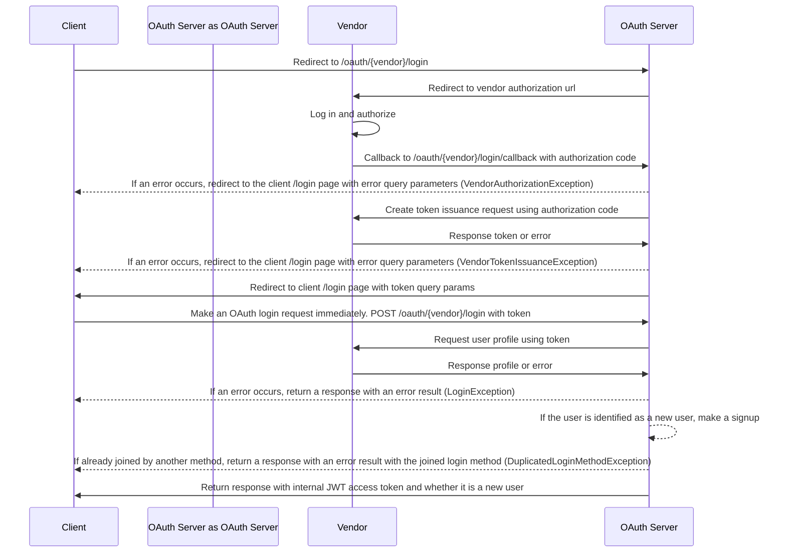

# oauth

## OAuth Flow
> **Note**
> This may be different from the general OAuth flow.  
> I modified the flow a little bit to give the server more roles.

```mermaid
sequenceDiagram
    participant Client as Client
    participant OAuth Server as OAuth Server
    participant Vendor as Vendor

    Client->>OAuth Server: Redirect to /oauth/{vendor}/login
    OAuth Server->>Vendor: Redirect to vendor authorization url
    Vendor->>Vendor: Log in and authorize
    Vendor->>OAuth Server: Callback to /oauth/{vendor}/login/callback with authorization code
    OAuth Server-->>Client: If an error occurs, redirect to the client /login page with error query parameters (VendorAuthorizationException)
    OAuth Server->>Vendor: Create token issuance request using authorization code
    Vendor->>OAuth Server: Response token or error
    OAuth Server-->>Client: If an error occurs, redirect to the client /login page with error query parameters (VendorTokenIssuanceException)
    OAuth Server->>Client: Redirect to client /login page with token query params
    Client->>OAuth Server: Make an OAuth login request immediately. POST /oauth/{vendor}/login with token
    OAuth Server->>Vendor: Request user profile using token
    Vendor->>OAuth Server: Response profile or error
    OAuth Server-->>Client: If an error occurs, return a response with an error result (LoginException)
    OAuth Server-->>OAuth Server: If the user is identified as a new user, make a signup
    OAuth Server-->>Client: If already joined by another method, return a response with an error result with the joined login method (DuplicatedLoginMethodException)
    OAuth Server->>Client: Return response with internal JWT access token and whether it is a new user
```
